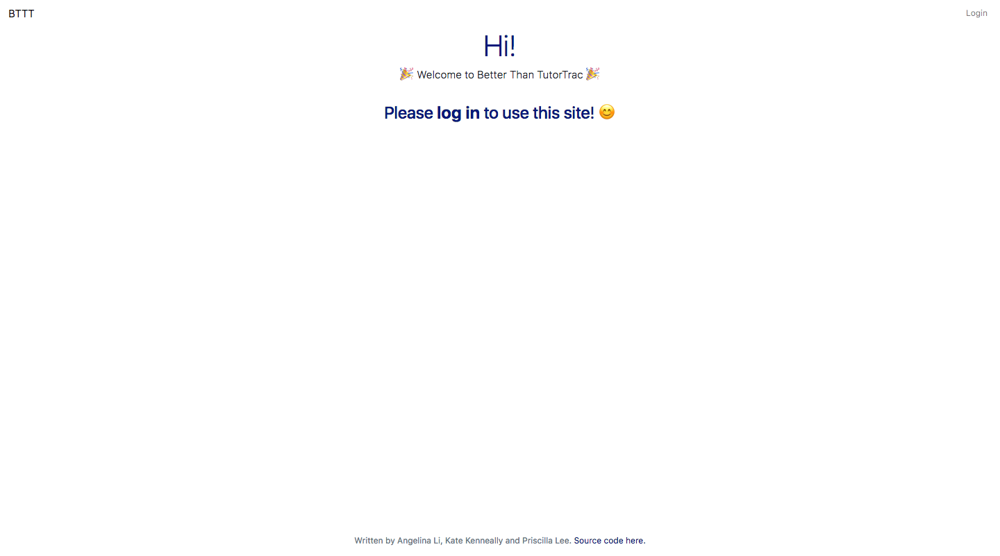
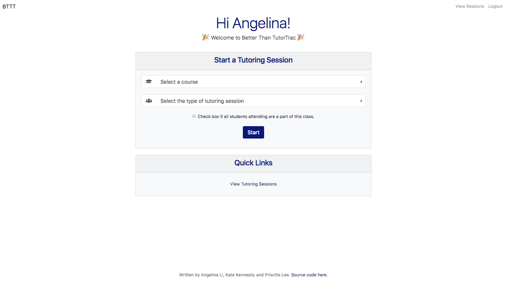
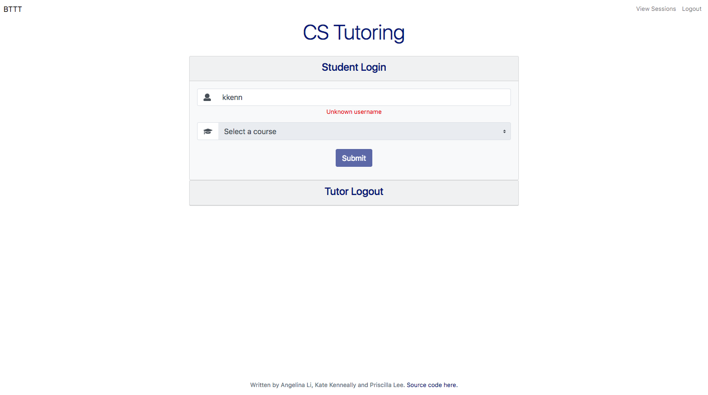
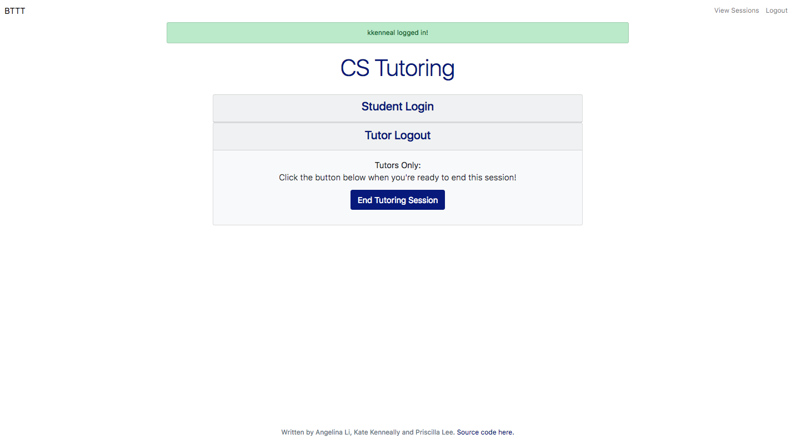
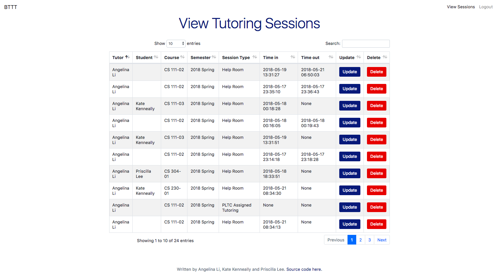
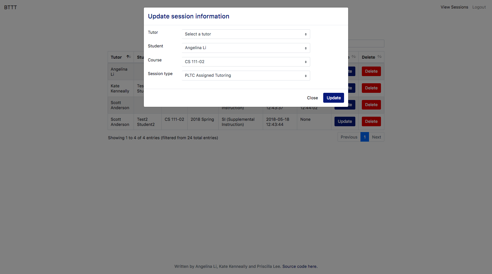
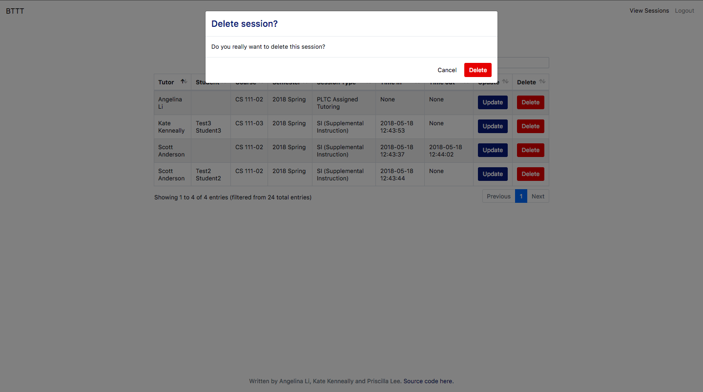

# tutor-trac-3

## What problem does this application address?
* It's difficult for school administrators to find some easy way to record the
  use of different school resources.
* Existing software that attempts to track the use of tutoring resources is
  difficult for both administrators and students to use.

## What does this application do?
* Allows students to check out different types of resources (both tutor and non
  tutor-related)
    * Provides a display to quickly see and maybe export your calendar?
    * Will send everyone a notification after visits are booked and/or
      automatically create a Google Calendar event
* Allows tutors and students to quickly log into visits
* Allow administrators to conduct the relevant data analysis in the browser.
    * Automatically run reports. What are the kind of data that you would like?

## Screen Caps

##### Home Page - Login Prompt

##### Home Page - After Logging In

##### Track Session - Session Login

##### Track Session - Session End

##### View Sessions - Paginated View

##### View Sessions - Update

##### View Sessions - Delete

### TODO
* Create database
